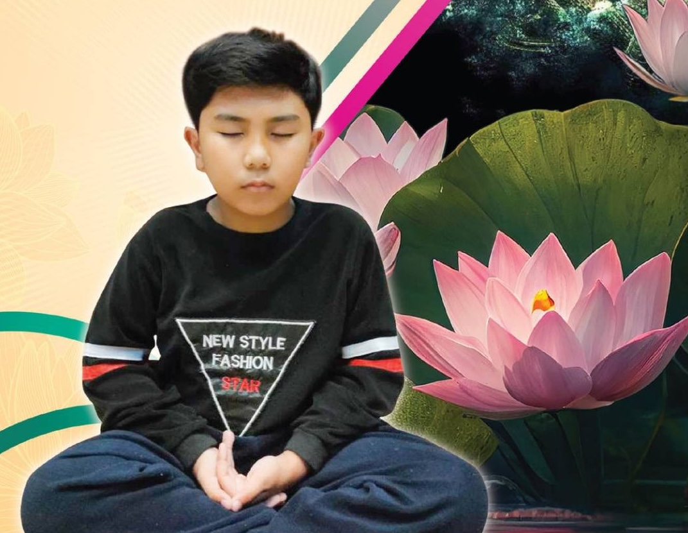

# ถอดความหนังสือ อ.น้องไนซ์

<https://nnice.krist7599555.com>

พุทธ คือ พุทธะ คำสอนขององค์พระศากยมุนี คงอยู่มิเปลี่ยนแปลง
บัญหาเกิดจากผู้ยึดในตัวบุคคลมากกว่าคำสอนของพุทธองค์ เมื่อถึงยุคนี้
ยุคที่ปัจจัยทางโลกส่งผลมากกว่าปัจจัยทางธรรม คือ บททดสอบและคัดกรอง
ผู้ปฏิบัติธรรมครั้งสำคัญ ในขณะที่บททดสอบทำหน้าที่ผู้ที่มีจุดมุ่งมั่นเจริญ
ตามแนวทางของท่าน ก็จะได้เจอธรรมะและแนวทางที่ถูกต้อง โดยส่งผ่านผู้ที่
ถูกเลือก เพื่อนำพาคนกลุ่มนี้ไปยัง ยุคพระศรีอาริย์ นับจากนี้จะเกิดเส้นขนาน
ที่ชัดเจน สำหรับผู้ที่มีกุศลจิตและจิตอกุศล

คำสอน แห่งองค์พุทธะ ใบโพธิ์ เสมือนคำสอนแห่งองค์พุทธะ ซึ่ง
ตรงนี้คือ หน้าที่ของเราโดยตรง เป็นสัญลักษณ์ที่จะนำพาให้จิตตื่นรู้ เพื่อให้
จิตที่ติดตามเรา ได้ตื่นรู้ ด้วยหลักคำสอนแห่งองค์พุทธะ และนั่นคือ สิ่งที่เรา
ได้รับหน้าที่มา ณ. กาลเวลานี้...

นิรมิตเทวาจุติ

